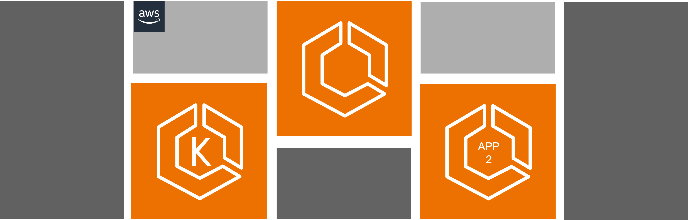

# AWS App2Container



## Components

1. Key Pair
2. S3 Bucket
3. IAM Policies
4. Security Group
5. EC2 Inatance (A2C Windows Worker). (*Optional*)
6. EC2 Inatance (A2C Linux Worker). (*Optional*)

## Providers

| Name | Version |
|------|---------|
| `aws` | ~> 5.47.0 |

## Resources

|Name |Resource |Type |More info |
|------|-------|-----|---------|
|this|`tls_private_key` |Hashicorp Terraform Registry|[tls_private_key](https://registry.terraform.io/providers/hashicorp/tls/latest/docs/resources/private_key)|
|key_pair|`aws_secretsmanager_secret`|Hashicorp Terraform Registry|[secretsmanager_secret](https://registry.terraform.io/providers/hashicorp/aws/latest/docs/resources/secretsmanager_secret)|
|key_pair|`aws_secretsmanager_secret_version`|Hashicorp Terraform Registry|[secretsmanager_secret_version](hhttps://registry.terraform.io/providers/hashicorp/aws/latest/docs/resources/secretsmanager_secret_version)|

## Modules

| Name |Service| Type | Source |
|------|-------|------|--------|
|`key_pair` |Key Pair |[GitHub Terraform AWS modules](https://github.com/terraform-aws-modules) |[github.com/terraform-aws-modules/terraform-aws-key-pair](https://github.com/terraform-aws-modules/terraform-aws-key-pair)|
|`s3_a2c` |S3 Bucket |[GitHub Terraform AWS modules](https://github.com/terraform-aws-modules) | [github.com/terraform-aws-modules/terraform-aws-s3-bucket](https://github.com/terraform-aws-modules/terraform-aws-s3-bucket) |
|`iam_a2c_policies` |IAM Policy| CNaM Custom module | ./policy |
|`sg_lnx` |Securiy Group|[GitHub Terraform AWS modules](https://github.com/terraform-aws-modules) |[github.com/terraform-aws-modules/terraform-aws-security-group/modules/ssh](https://github.com/terraform-aws-modules/terraform-aws-security-group/modules/ssh) |
|`a2c_instance_l` |EC2| [GitHub Terraform AWS modules](https://github.com/terraform-aws-modules) | [github.com/terraform-aws-modules/terraform-aws-ec2-instance](https://github.com/terraform-aws-modules/terraform-aws-ec2-instance) |
|`sg_win` |Security Group| [GitHub Terraform AWS modules](https://github.com/terraform-aws-modules) | [github.com/terraform-aws-modules/terraform-aws-security-group/modules/rdp](https://github.com/terraform-aws-modules/terraform-aws-security-group/modules/rdp) |
|`a2c_instance_w` |EC2| [GitHub Terraform AWS modules](https://github.com/terraform-aws-modules) | [github.com/terraform-aws-modules/terraform-aws-ec2-instance](https://github.com/terraform-aws-modules/terraform-aws-ec2-instance) |

## Inputs

| Name     | Description    | Sample  | Type    | Default  | Required |
|----------|----------------|---------|---------|----------|:--------:|
|`tf_deploy_id`|Deploy ID|`"m0801"`|`string`| |yes|
|`tf_ec2_ami_l`|AMI Linux|`"ami-0eb9d67c52f5c80e5"`|`string` | |yes/no|
|`tf_ec2_ami_w`|AMI Windows|`"ami-04eb6bba8a64bfa5b"`|`string` | |yes/no|
|`tf_ec2_create_a2c_instance_l`|Flag to true to enable create Worker Machine Linux|`true`|`bool`| |yes/no|
|`tf_ec2_create_a2c_instance_w`|Flag to true to enable create Worker Machine Windows|`false`|`bool`| |yes/no|
|`tf_ec2_instance_type_l`|Instance Type|`t3a.large`|`string`| |yes|
|`tf_ec2_instance_type_w`|Instance Type|`t3a.large`|`string`| |yes|
|`tf_ec2_public_ip`|Flag to true to enable assign public ip|`true`|`bool`|`true`|yes|
|`tf_ec2_subnet_id`|Subnet id|`"subnet-0a19463fef1783e4f"`|`string`| |yes|
|`tf_ec2_vol_size_l`|Root block size|`"64"`|`number`| |yes|
|`tf_ec2_vol_size_w`|Root block size|`"128"`|`number`| |yes|
|`tf_ec2_vol_type_l`|Root block type|`"gp3"`|`string`| |yes|
|`tf_ec2_vol_type_w`|Root block type|`"gp3"`|`string`| |yes|
|`tf_provider_aws_profile`|AWS Profile|`"default"`|`string`| |yes|
|`tf_provider_region`|AWS Region|`"us-west-2"`|`string`| |yes|
|`tf_s3_alias`|Alias|`"cnam"`|`string`||yes|
|`tf_sg_ips_mgmt`|CIDR Blocks to management access|`"201.222.222.89/32"`|`string`| |yes|
|`tf_sg_vpc_id`|VPC ID|`"vpc-0dc69cf72036f38cc"`|`string`| |yes|
|`tf_tags`|Deploy tags|`"Environment": "dev"`|`string`| |yes|
|`tf_the_sufix`|Random sufix|`"irws7din"`|`string`| |yes|

* Note: At least one option (*tf_ec2_create_a2c_instance_l or/and tf_ec2_create_a2c_instance_w*) must be in yes

### sample terraform.tfvars

```tf
tf_deploy_id                 = "m9905"
tf_ec2_ami_l                 = "ami-0eb9d67c52f5c80e5"
tf_ec2_ami_w                 = "ami-04eb6bba8a64bfa5b"
tf_ec2_create_a2c_instance_l = true
tf_ec2_create_a2c_instance_w = true
tf_ec2_instance_type_l       = "t3a.large"
tf_ec2_instance_type_w       = "t3a.large"
tf_ec2_public_ip             = true
tf_ec2_subnet_id             = "subnet-0a19463fef1783e4f"
tf_ec2_vol_size_l            = 64
tf_ec2_vol_size_w            = 128
tf_ec2_vol_type_l            = "gp3"
tf_ec2_vol_type_w            = "gp3"
tf_provider_aws_profile      = "elange-CNAM-SSO-AA-04883"
tf_provider_region           = "us-west-2"
tf_s3_alias                  = "cnam"
tf_sg_ips_mgmt               = ["201.221.228.89/32", "186.188.170.41/32"]
tf_sg_vpc_id                 = "vpc-08c02908530136660"
tf_tags = {
  "Provider" : "Escala 24x7",
  "Team" : "Cloud Native and Modernization",
  "Project" : "CNaM Classic deploy tools",
  "map-migrated" : "00000",
  "Iac" : "Terraform"
}
tf_the_sufix = "ryurjrgh"
```

## Secrets

| Name     |
|----------|
|`/cnam-tools/a2c-${var.tf_deploy_id}-${var.tf_the_sufix}/`**key-pair**|
